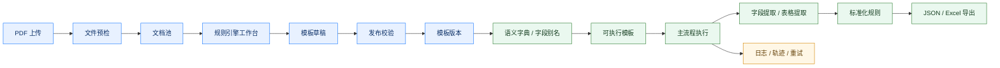
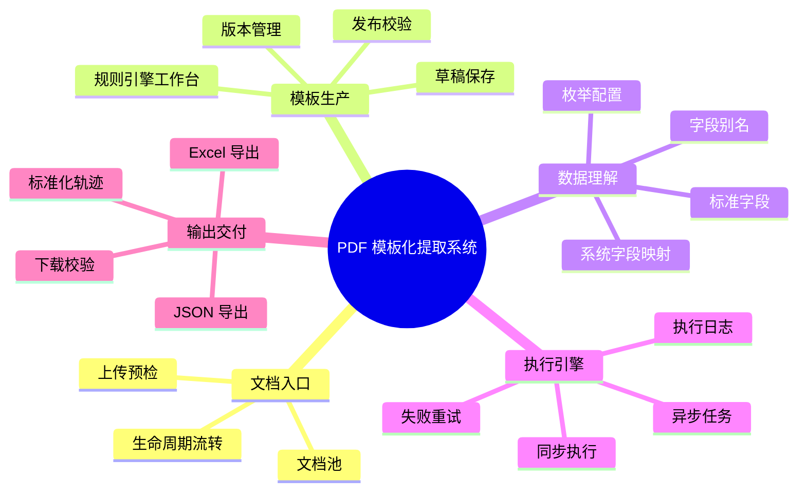
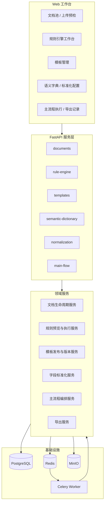

<h1 align="center">PDF 模板化提取系统</h1>

<p align="center">
  <strong>把企业 PDF 单据处理，从一次性解析脚本升级为可配置、可复用、可审计的数据生产线。</strong>
</p>

<p align="center">
  面向采购订单、发票、对账单、物流单据等版式稳定但来源复杂的企业 PDF，<br>
  通过可视化规则工作台、模板版本管理、标准字段映射、批量执行与失败追溯，<br>
  稳定产出可交付给业务系统的结构化数据。
</p>

<p align="center">
  
  
  
  
  
</p>

> **关键词**：模板化提取 / 可视化规则配置 / 模板版本管理 / 标准字段体系 / 批量执行与审计追溯

---

## 产品定位

PDF 模板化提取系统是一套面向企业单据 PDF 的结构化数据生产平台。

它将传统依赖开发维护的 PDF 解析脚本，升级为可视化配置、模板化复用、版本化管理和可审计执行的产品能力。系统支持从 PDF 上传预检、规则配置、模板发布、字段标准化、主流程执行到 JSON / Excel 导出的完整链路，适合长期处理采购订单、发票、对账单、物流单等版式稳定但来源复杂的企业文档。

相比单点 PDF 解析工具，本系统更关注企业落地中的四个问题：

- **规则如何复用**：通过模板草稿、发布校验和版本管理沉淀可复用规则资产。
- **字段如何统一**：通过语义字典、字段别名和标准化规则对齐企业字段体系。
- **执行如何稳定**：通过主流程、异步任务、失败重试和日志追踪支撑批量处理。
- **结果如何追溯**：通过字段结果、表格结果、标准化轨迹和导出记录形成审计闭环。

## 在线体验

测试环境访问地址：

[http://47.94.22.205:8080/](http://47.94.22.205:8080/)

## 它解决什么问题

企业里大量采购订单、发票、对账单、物流单据仍以 PDF 形式流转。传统处理方式通常会卡在三件事上：

- **一次性脚本多**：每新增一种供应商、客户或单据版式，都需要开发重新调整解析逻辑。
- **规则资产散**：提取规则散落在代码、脚本和临时配置里，难以复用、交接和持续维护。
- **过程不可控**：字段为什么没命中、模板是否可执行、结果如何标准化、失败能否重试，都缺少统一闭环。

本系统的核心价值，是把 PDF 提取从“能跑一次”变成“可以长期运营”：规则可以配置，模板可以发布，执行可以追踪，结果可以标准化，失败可以复盘。

## 核心亮点

### 1. 从“写脚本”变成“配模板”

传统 PDF 提取通常依赖一次性脚本。每新增一种供应商、客户或单据版式，都需要开发重新调整解析逻辑。

本系统将提取逻辑沉淀为模板资产：业务或实施人员可以在规则工作台中配置区域、字段、KV 规则和表格规则，并通过预览能力验证命中效果。

### 2. 从“能跑一次”变成“可长期运营”

系统不只关注单次提取结果，还覆盖模板草稿、发布校验、版本管理、归档恢复、执行记录、失败重试、导出记录和标准化轨迹。

这使 PDF 提取流程具备持续维护能力，适合长期处理大量客户、供应商和单据版式。

### 3. 从“字段抽出来”变成“数据能交付”

系统内置语义字典、字段别名、系统字段映射和标准化规则，不同模板提取出的字段可以统一对齐到企业内部字段体系。

最终结果不仅是解析文本，而是可以被业务系统、数据仓库或自动化流程直接消费的结构化数据。

### 4. 从“黑盒结果”变成“过程可追溯”

每次主流程执行都会保留运行记录、字段结果、表格结果、标准化轨迹、导出记录和失败重试链路。

当字段未命中、规则失效或结果异常时，可以回溯具体原因，而不是只能重新跑脚本或翻日志。

## 适用场景

本系统适合处理以下类型的 PDF 单据：

- 采购订单、销售订单、报价单、发票、对账单、物流单、装箱单等企业单据。
- 版式相对稳定，但字段位置、字段名称或表格结构存在差异的 PDF。
- 需要将 PDF 内容批量转成 JSON、Excel 或下游系统可消费数据的场景。
- 需要多人维护模板、追踪执行结果、复用历史规则的业务场景。
- 需要对字段做标准化、别名映射、枚举归一和结果审计的企业流程。

不适合：

- 完全无固定版式、强依赖语义理解的长文档阅读。
- 需要复杂视觉理解的扫描件，除非后续接入 OCR 能力。
- 只需要临时解析一两份文件的轻量场景。

## 产品闭环

系统围绕企业 PDF 单据处理构建完整闭环，而不是停留在单点解析能力：

1. **文档进入**：上传、预检、入池、状态管理。
2. **规则生产**：在工作台配置字段、区域、KV 和表格规则。
3. **模板沉淀**：保存草稿、发布校验、生成模板版本。
4. **语义对齐**：通过标准字段、别名映射和系统字段映射统一输出口径。
5. **批量执行**：使用可执行模板运行主流程，支持同步、异步、重试和日志。
6. **结果交付**：导出 JSON / Excel，并保留标准化轨迹和导出记录。

因此，本系统交付的不是一个 PDF parser，而是一套可持续运营的 PDF 数据生产平台。



## 与常见方案对比

| 方案 | 优点 | 局限 | 本系统的改进 |
| --- | --- | --- | --- |
| 一次性 Python 脚本 | 开发快，适合单一版式 | 规则散落、难复用、难交接、难审计 | 将规则沉淀为模板，支持版本、发布、预览和复用 |
| 通用 OCR / PDF 工具 | 能获取文本或表格 | 缺少业务字段体系，结果不可控 | 面向业务字段配置规则，并提供标准化输出 |
| 大模型抽取 | 泛化能力强 | 成本、稳定性、可解释性和批量一致性存在挑战 | 用模板规则保障稳定性，用语义字典保障字段统一 |
| 人工录入 | 灵活 | 成本高、慢、易错、不可规模化 | 通过主流程批量执行，保留日志、重试和导出记录 |

## 核心关键词

- **Template-driven**：用模板承载规则，而不是把逻辑写死在脚本里。
- **Versioned**：模板可发布、归档、恢复，并从历史版本创建草稿。
- **Auditable**：执行日志、标准化轨迹、导出记录和重试链路完整保留。
- **Standardized**：字段别名、系统字段映射和标准化规则统一输出口径。
- **Production-ready**：支持同步 / 异步执行、任务状态、失败重试和结果下载。

## 系统截图

### 模板管理

模板中心沉淀可复用的规则资产，展示模板总量、启用状态、主流程可用性、字段对照状态和模板列表数据。


### 规则引擎工作台

规则引擎工作台加载真实 PDF 样本，展示区域配置、字段规则、命中高亮、字段编辑和草稿保存状态，把解析逻辑转化为可配置模板。


## 功能模块

| 模块 | 价值 |
| --- | --- |
| 上传预检 | 在文档进入系统时完成文件、文本层、页面准备等检查，避免低质量 PDF 进入后续链路。 |
| 文档池 | 统一管理上传文档，支持筛选、归档、恢复、重检，以及进入规则引擎或主流程。 |
| 规则引擎工作台 | 围绕 PDF 页面配置区域、字段、KV/表格规则，支持预览、草稿和导出预览。 |
| 模板管理 | 模板列表、版本详情、发布校验、归档恢复、从版本创建草稿和可执行模板筛选。 |
| 语义字典 | 管理标准字段、字段别名和系统字段映射，让不同模板输出可以对齐企业字段体系。 |
| 标准化配置 | 管理枚举、标准化规则和规则测试，支撑跨客户、跨模板的数据归一化。 |
| 主流程执行 | 基于可执行模板运行提取任务，支持同步/异步执行、运行记录、失败重试和日志追踪。 |
| 结果导出 | 管理导出记录，支持 JSON/Excel 结果交付、文件下载和校验信息返回。 |



## 系统架构



## 快速开始

### 1. 启动基础服务

```bash
docker compose up -d postgres redis minio
```

### 2. 配置后端环境

```bash
cd backend
python -m venv .venv
.venv\Scripts\activate
pip install -e .[test]
```

根目录提供了 `.env.example`，可按需复制为 `.env` 并调整数据库、Redis、MinIO 和 CORS 配置。

### 3. 启动后端

```bash
cd backend
uvicorn app.main:app --reload
```

默认 API 前缀：

```text
http://localhost:8000/api/v1
```

### 4. 启动前端

```bash
cd frontend
npm install
npm run dev
```

默认前端地址：

```text
http://localhost:5173
```

## 技术栈

```text
frontend/   React + TypeScript + Vite + Ant Design + Zustand + PDF.js
backend/    FastAPI + Pydantic + SQLAlchemy + Celery + Redis
```

核心依赖：

- 前端：`React 18`、`TypeScript`、`Vite`、`Ant Design`、`pdfjs-dist`、`axios`、`zustand`
- 后端：`FastAPI`、`Pydantic v2`、`SQLAlchemy 2`、`psycopg`、`Celery`、`Redis`、`boto3`、`PyMuPDF`、`pdfplumber`、`openpyxl`
- 基础设施：`PostgreSQL 16`、`Redis 7`、`MinIO`、`Docker Compose`

## 常用命令

```bash
# 前端类型检查与构建
cd frontend
npm run lint
npm run build

# 后端测试
cd backend
pytest

# 基础服务
docker compose up -d postgres redis minio
docker compose down
```

## 演示路径

1. 上传一份带文本层的 PDF，完成预检。
2. 在文档池确认状态，并进入规则引擎工作台。
3. 配置区域、字段、KV 或表格规则，并用预览验证命中结果。
4. 保存草稿，完成发布校验，生成模板版本。
5. 维护字段别名和标准化配置，使模板达到可执行状态。
6. 从文档池进入主流程，选择模板执行提取任务。
7. 查看运行详情、日志、标准化轨迹和重试链路。
8. 导出 JSON 或 Excel，交付给下游系统。

## 联系方式

欢迎通过微信交流项目、试用反馈或合作需求。

<p align="center">
  
</p>
